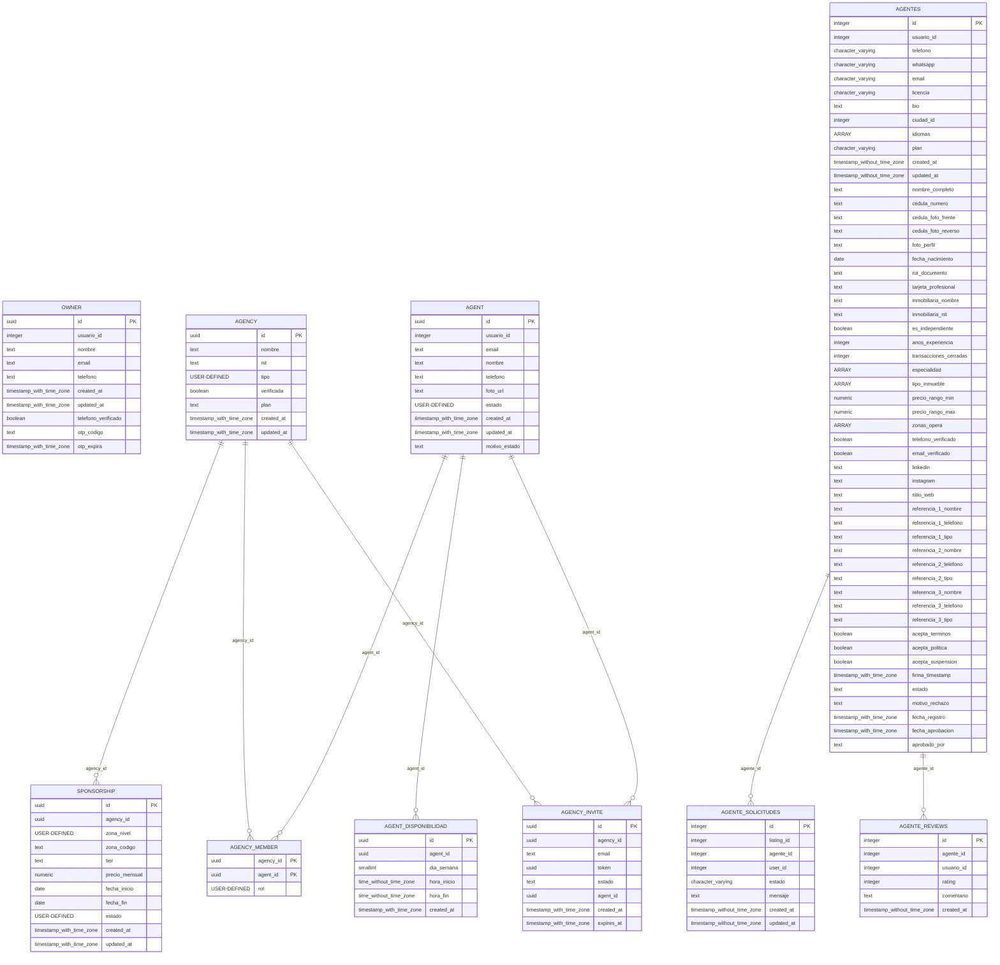
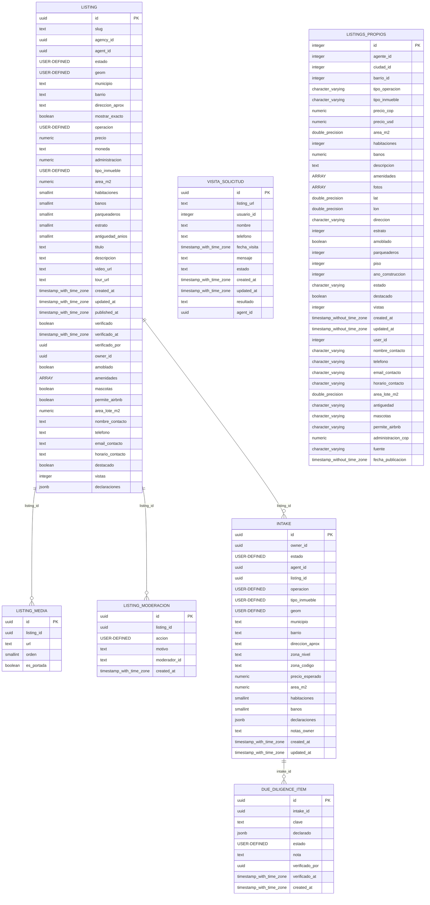
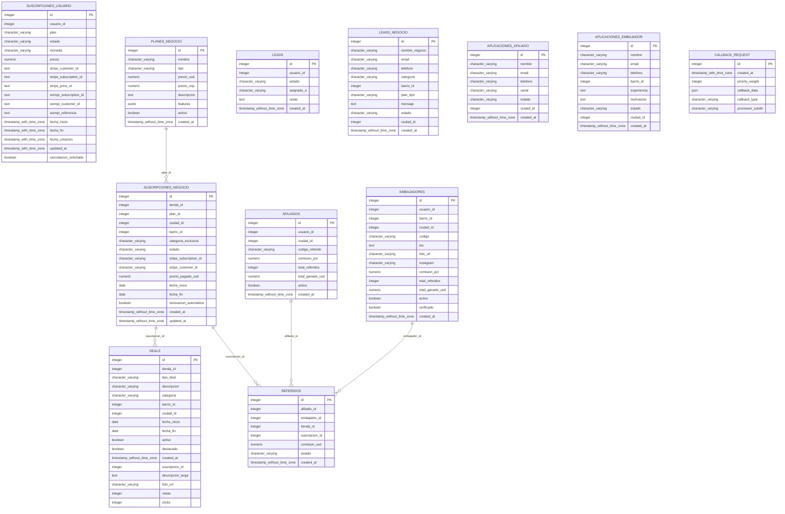
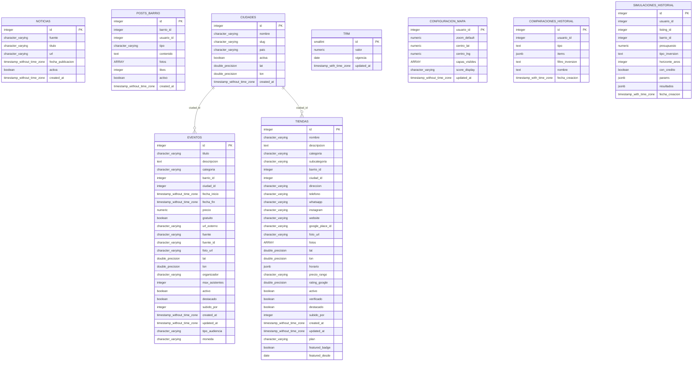

# Base de datos — Medellín Social

*Generado 2026-08-17 directamente desde `information_schema` de la DB local (refleja el schema real, no solo lo que dicen las migraciones — ver `project_data_gap_prod` en memoria sobre drift local↔prod). Se excluyeron las tablas internas de Airflow que quedaron en este mismo Postgres (`ab_*`, `dag*`, `task_*`, `xcom`, etc. — ver `project_airflow_stack`).*

**Para editar visualmente:** pega [`docs/database/schema.dbml`](./database/schema.dbml) completo en [drawsql.app](https://drawsql.app) (botón Import) o en [dbdiagram.io](https://dbdiagram.io) — ambos leen formato DBML.

**Para ver aquí mismo:** los diagramas de abajo son Mermaid — GitHub los renderiza nativo en el `.md`, sin plugins.

## Índice

- [Auth & Usuarios](#auth-usuarios)
- [Agentes, Agencias y Realtor](#agentes-agencias)
- [Listings (modelo unificado) y moderación](#listings-core)
- [Suscripciones, afiliados y negocio](#negocio-monetizacion)
- [Comunidad (eventos, negocios locales, noticias)](#comunidad)
- [Raw — listings scrapeados (fuentes externas)](#raw-listings)
- [Raw — geografía y datos de referencia](#raw-geo-referencia)
- [Staging (ETL intermedio)](#staging)
- [Analytics (derivadas / scoring)](#analytics)

## Auth & Usuarios

```mermaid
erDiagram
    USUARIOS {
        integer id PK
        character_varying email
        character_varying password_hash
        character_varying nombre
        character_varying apellido
        timestamp_without_time_zone created_at
        timestamp_without_time_zone last_login
        boolean activo
        character_varying rol
        boolean newsletter_activo
        integer newsletter_barrio_id
        ARRAY newsletter_intereses
        timestamp_without_time_zone fecha_suscripcion
        character_varying plan
        character_varying perfil_busqueda
        boolean onboarding_completado
        character_varying origen_registro
        boolean email_verificado
    }
    PERFIL_INVERSOR {
        integer id PK
        integer usuario_id
        character_varying presupuesto
        bigint presupuesto_min_cop
        bigint presupuesto_max_cop
        character_varying objetivo
        character_varying perfil_riesgo
        timestamp_without_time_zone created_at
        timestamp_without_time_zone updated_at
        character_varying tipo_usuario
        character_varying n_unidades
        character_varying tipo_gestion
        character_varying target_inquilino
        character_varying amoblado
        character_varying tipo_pago
        character_varying horizonte_inversion
        boolean primera_propiedad
        boolean wants_agent
        timestamp_without_time_zone onboarding_completado_at
    }
    TOKEN_BLACKLIST {
        integer id PK
        text token
        integer usuario_id
        timestamp_without_time_zone revoked_at
    }
    PASSWORD_RESET_TOKENS {
        integer id PK
        integer usuario_id
        text token
        timestamp_with_time_zone expires_at
        boolean used
        timestamp_with_time_zone created_at
    }
    EMAIL_VERIFICATION_TOKENS {
        integer id PK
        integer usuario_id
        text token
        timestamp_with_time_zone expires_at
        boolean used
        timestamp_with_time_zone created_at
    }
    FAVORITOS {
        integer id PK
        integer usuario_id
        integer barrio_id
        text nota
        timestamp_without_time_zone created_at
        character_varying listing_uid
        character_varying tipo
    }
    HISTORIAL {
        integer id PK
        integer usuario_id
        character_varying tipo
        integer barrio_id
        jsonb metadata
        timestamp_without_time_zone created_at
    }
    USER_SESSIONS {
        integer id PK
        character_varying session_id
        integer usuario_id
        integer ciudad_id
        character_varying device_type
        character_varying browser
        character_varying os
        character_varying ip_hash
        character_varying referrer
        character_varying utm_source
        character_varying utm_medium
        character_varying utm_campaign
        timestamp_without_time_zone started_at
        timestamp_without_time_zone ended_at
        integer duration_segundos
        integer total_eventos
        integer paginas_vistas
    }
    USER_INTERESTS {
        integer id PK
        integer usuario_id
        ARRAY top_barrios
        character_varying inversion_preferida
        numeric precio_min_avg
        numeric precio_max_avg
        character_varying tipo_inmueble_top
        ARRAY categorias_eventos_top
        ARRAY categorias_tiendas_top
        integer total_sesiones
        integer total_eventos
        integer avg_session_duration_seg
        integer dias_activo
        timestamp_without_time_zone ultimo_activo
        integer engagement_score
        integer inversion_intent_score
        timestamp_without_time_zone updated_at
    }
    USER_EVENTS {
        bigint id
        integer usuario_id
        character_varying session_id
        character_varying event_type
        character_varying entity_type
        character_varying entity_id
        integer barrio_id
        integer ciudad_id
        integer duration_ms
        jsonb metadata
        timestamp_without_time_zone created_at
    }
    USUARIOS ||--o{ EMAIL_VERIFICATION_TOKENS : "usuario_id"
    USUARIOS ||--o{ FAVORITOS : "usuario_id"
    USUARIOS ||--o{ HISTORIAL : "usuario_id"
    USUARIOS ||--o{ PASSWORD_RESET_TOKENS : "usuario_id"
    USUARIOS ||--o{ PERFIL_INVERSOR : "usuario_id"
    USUARIOS ||--o{ TOKEN_BLACKLIST : "usuario_id"
    USUARIOS ||--o{ USER_EVENTS : "usuario_id"
    USUARIOS ||--o{ USER_INTERESTS : "usuario_id"
    USUARIOS ||--o{ USER_SESSIONS : "usuario_id"
```

## Agentes, Agencias y Realtor

## Listings (modelo unificado) y moderación

## Suscripciones, afiliados y negocio

## Comunidad (eventos, negocios locales, noticias)

## Raw — listings scrapeados (fuentes externas)

```mermaid
erDiagram
    RAW_LISTINGS_FINCARAIZ {
        integer id PK
        text fuente
        text tipo_operacion
        text tipo_inmueble
        numeric precio
        numeric area_m2
        integer habitaciones
        integer banos
        text direccion_raw
        text barrio_raw
        text url
        timestamp_with_time_zone fecha_scraping
        boolean activo
        integer barrio_id
        jsonb raw_data
        date fecha_publicacion
        integer dias_en_mercado
        character_varying dedup_hash
        USER-DEFINED geom
        numeric lat
        numeric lon
        text municipio_raw
        integer estrato_real
        boolean url_activa
        timestamp_without_time_zone url_validada_at
        timestamp_without_time_zone fecha_primera_vez
        timestamp_without_time_zone fecha_ultima_vez_activa
        text descripcion
        ARRAY amenidades
        ARRAY fotos
        smallint parqueaderos
        smallint piso
        text antiguedad
        numeric administracion
    }
    RAW_LISTINGS_METROCUADRADO {
        integer id PK
        text fuente
        text tipo_operacion
        text tipo_inmueble
        numeric precio
        numeric area_m2
        integer habitaciones
        integer banos
        text direccion_raw
        text barrio_raw
        text url
        double_precision lat
        double_precision lon
        integer estrato
        timestamp_with_time_zone fecha_scraping
        boolean activo
        integer barrio_id
        jsonb raw_data
        date fecha_publicacion
        integer dias_en_mercado
        character_varying dedup_hash
        USER-DEFINED geom
        text municipio_raw
        integer estrato_real
        boolean url_activa
        timestamp_without_time_zone url_validada_at
        timestamp_without_time_zone fecha_primera_vez
        timestamp_without_time_zone fecha_ultima_vez_activa
        ARRAY fotos
        text descripcion
        ARRAY amenidades
        smallint parqueaderos
        smallint piso
        text antiguedad
        numeric administracion
    }
    RAW_LISTINGS_PREMIUM {
        integer id PK
        character_varying fuente
        character_varying titulo
        text descripcion
        bigint precio_cop
        bigint precio_usd
        numeric area_m2
        integer habitaciones
        numeric banos
        integer parqueaderos
        integer piso
        integer estrato
        boolean amoblado
        ARRAY amenidades
        character_varying barrio_raw
        integer barrio_id
        character_varying municipio
        character_varying direccion_raw
        numeric lat
        numeric lon
        character_varying agente_nombre
        character_varying agente_telefono
        character_varying agente_email
        character_varying agencia
        character_varying url
        ARRAY fotos
        character_varying tipo_operacion
        character_varying tipo_inmueble
        date fecha_publicacion
        timestamp_without_time_zone fecha_scraping
        character_varying dedup_hash
        character_varying fuente_tipo
        USER-DEFINED geom
    }
    RAW_LISTINGS_RENTA_MEDIA {
        integer id PK
        text fuente
        numeric precio_mes_cop
        numeric precio_mes_usd
        numeric area_m2
        integer habitaciones
        text barrio_raw
        integer barrio_id
        text url
        timestamp_with_time_zone fecha_scraping
        boolean amoblado
        jsonb raw_data
        character_varying titulo
        numeric banos
        boolean incluye_servicios
        integer min_noches
        numeric lat
        numeric lon
        character_varying dedup_hash
        text descripcion
        ARRAY fotos
        ARRAY amenidades
    }
    RAW_LISTINGS_CASADOLCECASA {
        bigint id PK
        text codigo
        text fuente
        text tipo_operacion
        text tipo_inmueble
        numeric precio
        numeric area_m2
        integer habitaciones
        integer banos
        smallint parqueaderos
        smallint piso
        integer estrato_real
        text antiguedad
        text direccion_raw
        text barrio_raw
        text municipio_raw
        numeric lat
        numeric lon
        USER-DEFINED geom
        integer barrio_id
        ARRAY amenidades
        ARRAY fotos
        text descripcion
        text url
        character_varying dedup_hash
        boolean activo
        jsonb raw_data
        timestamp_with_time_zone fecha_scraping
    }
    RAW_LISTINGS_PRECIO_HISTORIAL {
        integer id PK
        text listing_url
        text fuente
        numeric precio_anterior
        numeric precio_nuevo
        date fecha_cambio
        timestamp_without_time_zone created_at
    }
    RAW_LISTING_MEDIA_MIRROR {
        text url PK
        uuid media_uid
        text fuente
        text portada_r2
        ARRAY fotos_r2
        ARRAY content_hashes
        smallint n_fotos
        boolean activa
        timestamp_with_time_zone first_seen
        timestamp_with_time_zone last_seen
    }
    RAW_LISTING_VISTAS {
        integer id PK
        character_varying listing_url
        integer usuario_id
        character_varying ip_hash
        timestamp_without_time_zone created_at
    }
    RAW_FAVORITOS_LISTINGS {
        integer id PK
        integer usuario_id
        character_varying url
        integer barrio_id
        timestamp_without_time_zone created_at
    }
    RAW_AIRBNB_LISTINGS_PORTAL {
        bigint listing_id PK
        text listing_name
        text listing_type
        text room_type
        bigint host_id
        text host_name
        boolean superhost
        double_precision latitude
        double_precision longitude
        integer guests
        integer bedrooms
        integer beds
        numeric baths
        integer min_nights
        text cancellation_policy
        boolean professional_management
        boolean guest_favorite
        integer num_reviews
        numeric rating_overall
        numeric rating_accuracy
        numeric rating_checkin
        numeric rating_cleanliness
        numeric rating_communication
        numeric rating_location
        numeric rating_value
        text currency
        numeric cleaning_fee
        numeric ttm_revenue
        numeric ttm_revenue_native
        numeric ttm_avg_rate
        numeric ttm_avg_rate_native
        double_precision ttm_occupancy
        numeric ttm_revpar
        numeric ttm_revpar_native
        integer ttm_reserved_days
        integer ttm_available_days
        integer ttm_total_days
        numeric ttm_avg_min_nights
        numeric ttm_avg_length_of_stay
        numeric l90d_revenue
        numeric l90d_avg_rate
        double_precision l90d_occupancy
        numeric l90d_revpar
        integer l90d_reserved_days
        integer barrio_id
        timestamp_with_time_zone fecha_descarga
        text amenities
    }
    RAW_AIRBNB_CALENDAR_PORTAL {
        integer id PK
        bigint listing_id
        date year_month
        integer vacant_days
        integer reserved_days
        numeric occupancy
        numeric revenue
        numeric rate_avg
        numeric booked_rate_avg
        numeric booking_lead_time_avg
        numeric length_of_stay_avg
        numeric min_nights_avg
        numeric native_revenue
        numeric native_rate_avg
        numeric native_booked_rate_avg
        timestamp_with_time_zone fecha_carga
    }
    RAW_AIRBNB_BARRIOS {
        integer id PK
        integer barrio_id
        integer n_listings
        numeric ocupacion_pct
        numeric adr_cop
        numeric ingresos_anuales_estimados
        timestamp_with_time_zone fecha_consulta
        jsonb raw_data
        text n_listings_fuente
    }
    RAW_AIRBNB_MERCADO_VALLE {
        integer id PK
        character_varying municipio
        character_varying barrio_raw
        integer barrio_id
        integer n_listings
        double_precision ocupacion_pct
        double_precision ocupacion_p25
        double_precision ocupacion_p50
        double_precision ocupacion_p75
        double_precision adr_usd
        double_precision adr_cop
        double_precision ingresos_anuales_usd
        double_precision ingresos_anuales_cop
        double_precision revpar
        double_precision pct_entire_home
        double_precision pct_private_room
        double_precision rating_promedio
        double_precision reviews_promedio
        double_precision pct_superhosts
        character_varying fuente
        character_varying fase
        timestamp_without_time_zone fecha_extraccion
    }
```

## Raw — geografía y datos de referencia

```mermaid
erDiagram
    RAW_BARRIOS {
        integer id PK
        text nombre
        text comuna
        text municipio
        text fuente
        jsonb raw_props
        USER-DEFINED geometry
        timestamp_with_time_zone cargado_en
        boolean excluir_inversion
        character_varying uso_suelo_dominante
        integer uso_suelo_score
        integer ciudad_id
    }
    RAW_COMUNAS {
        integer id PK
        text codigo
        text nombre
        text comuna_full
        text fuente
        jsonb raw_props
        USER-DEFINED geometry
        timestamp_with_time_zone cargado_en
    }
    RAW_ESTRATOS {
        integer id PK
        smallint estrato
        smallint estrato_min
        smallint estrato_max
        text codigo_comuna
        text nombre_comuna
        text fuente
        text modo_carga
        text nota
        jsonb raw_props
        USER-DEFINED geometry
        timestamp_with_time_zone cargado_en
    }
    RAW_ESTRATOS_MANZANA {
        integer estrato
        text comuna
        text barrio
        text codigo_barrio
        USER-DEFINED geometry
        timestamp_without_time_zone fecha_sincronizacion
        text fuente
    }
    RAW_CATASTRO_MEDELLIN {
        integer id PK
        character_varying matricula_anonimizada
        integer cd_comuna
        character_varying ds_comuna
        numeric nm_ar_lote
        numeric nm_ar_constru
        numeric area_desenglobe
        integer cd_uso
        integer cd_tipo
        integer cd_uso_lote
        integer cd_tipo_lote
        character_varying ds_uso_tipo
        bigint vl_av_lote
        bigint vl_av_constru
        bigint vl_avaluo_total
        character_varying cd_ind_ru_ur
        timestamp_without_time_zone fecha_carga
    }
    RAW_CATASTRO_MEDELLIN_VIGENTE {
        integer id PK
        character_varying matricula_anonimizada
        integer cd_comuna
        character_varying ds_comuna
        numeric nm_ar_lote
        numeric nm_ar_constru
        numeric area_desenglobe
        integer cd_uso
        integer cd_tipo
        integer cd_uso_lote
        integer cd_tipo_lote
        character_varying ds_uso_tipo
        bigint vl_av_lote
        bigint vl_av_constru
        bigint vl_avaluo_total
        character_varying cd_ind_ru_ur
        character_varying cd_vig_pred
        timestamp_without_time_zone fecha_carga
    }
    RAW_COMPRAVENTAS_ORIPS {
        integer id PK
        integer anio
        date fecha_registro
        text municipio
        text tipo_inmueble
        numeric area_m2
        bigint valor_cop
        text oficina_registro
        timestamp_without_time_zone fecha_carga
    }
    RAW_CRIMINALIDAD_COMUNAS {
        integer id PK
        smallint anio
        text conducta
        text codigo_comuna
        integer cantidad_casos
        timestamp_with_time_zone cargado_en
    }
    RAW_CRIMINALIDAD_COMUNAS_MES {
        integer id PK
        smallint anio
        smallint mes
        text conducta
        text codigo_comuna
        integer cantidad_casos
        timestamp_with_time_zone cargado_en
    }
    RAW_CRIMINALIDAD_MUNICIPIOS {
        integer id PK
        text municipio
        text departamento
        integer anio
        text conducta
        integer cantidad_casos
        text fuente
        timestamp_with_time_zone cargado_en
    }
    RAW_IPVN_DANE {
        integer id PK
        smallint anio
        character trimestre
        text estrato
        numeric indice
        numeric variacion_trimestral_pct
        numeric variacion_anual_pct
        text tipo_vivienda
        timestamp_with_time_zone cargado_en
    }
    RAW_IPVU_BANREP {
        integer id PK
        smallint anio
        character trimestre
        numeric indice_nominal
        numeric indice_real
        numeric variacion_trimestral_pct
        numeric variacion_anual_pct
        text fuente
        timestamp_with_time_zone cargado_en
    }
    RAW_POIS {
        integer id PK
        text osm_id
        text nombre
        text tipo
        text subtipo
        jsonb raw_tags
        USER-DEFINED geometry
        timestamp_with_time_zone cargado_en
    }
    RAW_POT_USOS_MEDELLIN {
        text areagraluso
        text subcategoria
        integer cod_cat_uso
        integer cod_subcat_uso
        USER-DEFINED geometry
        text fuente
    }
    RAW_TRAFICO_MUESTRAS {
        bigint id PK
        text punto_tipo
        text punto_id
        text nombre
        text zona
        smallint hora_local
        smallint dow
        numeric jam_avg
        numeric jam_max
        numeric speed_ratio
        integer n_segmentos
        timestamp_with_time_zone muestreado_en
    }
    RAW_PARAMETROS_SISTEMA {
        text nombre PK
        text valor
        text fuente
        timestamp_with_time_zone updated_at
    }
```

## Staging (ETL intermedio)

```mermaid
erDiagram
    STAGING_STG_LISTINGS {
        integer id
        text fuente
        text tipo_operacion
        text tipo_inmueble
        numeric precio
        numeric area_m2
        integer habitaciones
        integer banos
        text direccion_raw
        text barrio_raw
        integer barrio_id
        text url
        timestamp_with_time_zone fecha_scraping
        boolean activo
        numeric precio_m2
        date fecha_publicacion
        integer dias_en_mercado
        numeric precio_venta_real
        numeric precio_arriendo_real
    }
    STAGING_STG_LISTINGS_UNIFICADO {
        text listing_uid
        text fuente
        text tier
        text tipo_operacion
        text tipo_inmueble
        numeric precio_cop
        bigint precio_usd
        numeric precio_min_cluster
        numeric precio_max_cluster
        boolean precio_variable
        numeric area_m2
        numeric precio_m2
        integer habitaciones
        numeric banos
        text barrio_raw
        integer barrio_id
        text direccion_raw
        double_precision lat
        double_precision lon
        USER-DEFINED geom
        text url
        ARRAY fotos
        timestamp_with_time_zone fecha_scraping
        bigint n_duplicados
        integer estrato_real
        boolean amoblado
        text antiguedad
        ARRAY amenidades
        boolean verificado
    }
    STAGING_STG_LISTINGS_V1_DEPRECATED {
        integer id
        text fuente
        text tipo_operacion
        text tipo_inmueble
        numeric precio
        numeric area_m2
        integer habitaciones
        integer banos
        text direccion_raw
        text barrio_raw
        integer barrio_id
        text url
        timestamp_with_time_zone fecha_scraping
        boolean activo
        numeric precio_m2
        date fecha_publicacion
        integer dias_en_mercado
        numeric precio_venta_real
        numeric precio_arriendo_real
    }
    STAGING_STG_AIRBNB_SEGMENTADO {
        bigint listing_id
        integer barrio_id
        text room_type
        integer bedrooms
        numeric baths
        double_precision ttm_occupancy
        numeric ttm_avg_rate_usd
        numeric ttm_avg_rate_cop
        numeric ttm_revenue_usd
        numeric ttm_avg_min_nights
        numeric ttm_avg_length_of_stay
        text tipo_renta
        boolean flag_mensual
    }
    STAGING_STG_SEGURIDAD {
        integer comuna_id
        text codigo
        text nombre
        boolean zona_turistica
        bigint casos_totales_3anios
        bigint casos_residente_3anios
        numeric casos_por_1000hab
        numeric casos_residente_por_1000hab
        integer score_seguridad_residente
        integer score_seguridad_transito
        text tendencia
    }
    STAGING_STG_VALORIZACION {
        smallint anio
        character trimestre
        text periodo
        date fecha_inicio
        numeric ipvn_medellin
        numeric ipvu_medellin
        numeric var_anual_nueva_pct
        numeric var_anual_usada_pct
        numeric var_promedio_pct
        numeric var_anual_bajo_pct
        numeric var_anual_medio_pct
        numeric var_anual_alto_pct
        text tendencia
        timestamp_with_time_zone calculado_en
    }
    STAGING_BARRIOS_ENRIQUECIDOS {
        integer id
        text barrio
        integer comuna_numero
        text comuna_nombre
        text tipo_division
        text municipio
        smallint estrato_predominante
        smallint estrato_min
        smallint estrato_max
        text estrato_fuente
        numeric area_km2
        USER-DEFINED geometry
    }
    STAGING_STG_AIRBNB_AMENITIES {
        bigint listing_id
        integer barrio_id
        boolean flag_wifi
        boolean flag_ac
        boolean flag_kitchen
        boolean flag_washer
        boolean flag_heating
        boolean flag_hot_water
    }
```

## Analytics (derivadas / scoring)

```mermaid
erDiagram
    ANALYTICS_BARRIOS_CD {
        integer barrio_id PK
        integer cd_comuna
        timestamp_with_time_zone refreshed_at
    }
    ANALYTICS_BARRIOS_SCORE {
        integer barrio_id
        text nombre_barrio
        text comuna
        integer estrato
        integer score_total
        text categoria_inversion
        text color_hex
        integer score_yield
        integer score_precio
        integer score_seguridad
        integer score_conectividad
        integer score_confiabilidad
        numeric mejor_yield_pct
        text mejor_tipo_renta
        text estado_precio
        text categoria_seguridad
        numeric dist_metro_km
        bigint n_datos_total
        numeric precio_m2_venta
        numeric arriendo_p50
        numeric score_airbnb_ocupacion
        numeric adr_cop
        timestamp_with_time_zone calculado_en
    }
    ANALYTICS_BARRIOS_SCORE_CONSOLIDADO {
        integer barrio_id
        text nombre_barrio
        text comuna
        text municipio
        integer score_corto
        text categoria_corto
        text color_corto
        integer pts_yield_airbnb
        numeric score_mediano
        text categoria_mediano
        text color_mediano
        integer pts_yield_medio
        integer score_largo
        text categoria_largo
        text color_largo
        integer pts_yield_largo
        text perfil_recomendado
        numeric precio_m2_venta_p50
        numeric arriendo_p50
        text estado_precio
        numeric yield_airbnb_pct
        numeric yield_bruto_pct
        numeric yield_renta_media_pct
        integer liquidez_score
        text categoria_liquidez
        text tiempo_estimado_venta
        text nota_metodologia
        numeric indice_verde_pct
        text categoria_verde
        integer score_verde
        numeric pct_wifi
        numeric pct_ac
        numeric pct_kitchen
        numeric pct_washer
        integer score_equipamiento
        timestamp_with_time_zone calculado_en
    }
    ANALYTICS_BARRIOS_LIQUIDEZ {
        integer barrio_id
        numeric precio_venta_m2_p50
        bigint n_listings_venta_total
        numeric dias_mercado_p25
        numeric dias_mercado_p50
        numeric pct_frescos
        numeric pct_antiguos
        numeric pct_listings_con_fecha
        bigint n_listings_airbnb
        integer liquidez_score
        text categoria_liquidez
        text tiempo_estimado_venta
        text nota_metodologia
        timestamp_with_time_zone calculado_en
    }
    ANALYTICS_BARRIOS_MERCADO {
        integer barrio_id
        text barrio_nombre
        text comuna
        text municipio
        bigint n_venta
        numeric precio_venta_promedio
        numeric area_promedio_m2
        numeric precio_venta_m2_p25
        numeric precio_venta_m2_p50
        numeric precio_venta_m2_p75
        bigint n_arriendo
        numeric precio_arriendo_p25
        numeric precio_arriendo_p50
        numeric precio_arriendo_p75
        numeric ratio_precio_arriendo
        numeric yield_bruto
        integer airbnb_n_listings
        numeric ocupacion_airbnb_pct
        numeric adr_noche_cop
        numeric yield_airbnb_pct
        numeric pbn_precio_justo
        numeric pmn_neto
        numeric poi_precio_oferta
        numeric pbn_precio_justo_m2
        numeric diferencia_total_pct
        numeric diferencia_m2_pct
        text estado_precio
        integer score_seguridad
        text categoria_seguridad
        boolean zona_turistica
        text nota_seguridad
        text tendencia_seguridad
        integer score_seguridad_transito
        numeric precio_renta_media_p50
        numeric precio_renta_media_usd
        numeric yield_renta_media_pct
        numeric yield_renta_media_airbnb_pct
        bigint n_listings_renta_media_airbnb
        numeric ocupacion_renta_media_airbnb_pct
        numeric adr_renta_media_airbnb_usd
        bigint n_listings_renta_media
        numeric premium_vs_largo_pct
        numeric precio_m2_real_p50
        numeric arriendo_real_p50
        numeric yield_real_pct
        timestamp_with_time_zone calculado_en
    }
    ANALYTICS_BARRIOS_MEDIANAS {
        integer barrio_id
        text tipo_inmueble
        bigint m2_mediana
        bigint arr_mediana
        timestamp_with_time_zone refreshed_at
        bigint m2_p25
        bigint m2_p75
        bigint arr_p25
        bigint arr_p75
    }
    ANALYTICS_BARRIOS_CONTEXTO {
        integer barrio_id PK
        numeric yield_bruto_pct
        integer n_listings_airbnb
        numeric score_corto
        numeric score_mediano
        numeric score_largo
        numeric liquidez_score
        numeric indice_nomada
        numeric seguridad_score
        numeric var_anual_pct
        numeric pct_wifi
        timestamp_with_time_zone refreshed_at
    }
    ANALYTICS_BARRIOS_AMENITIES {
        integer barrio_id
        text nombre_barrio
        text municipio
        bigint n_listings
        numeric pct_wifi
        numeric pct_ac
        numeric pct_kitchen
        numeric pct_washer
        integer score_equipamiento
        timestamp_with_time_zone calculado_en
    }
    ANALYTICS_BARRIOS_POIS_DISTANCIA {
        integer barrio_id PK
        text nombre_barrio
        text municipio
        numeric dist_metro_km
        numeric dist_parque_km
        numeric dist_mall_km
        integer n_universidades_2km
        integer n_hospitales_3km
        timestamp_with_time_zone calculado_en
        integer n_cafes_500m
        integer n_coworking_1km
        integer n_gimnasios_1km
        integer n_restaurantes_500m
        integer n_bares_500m
        numeric indice_nomada
        integer n_yoga_1km
        numeric dist_yoga_km
        integer n_colegios_1km
        numeric dist_colegio_km
        integer walk_score
        integer transit_score
    }
    ANALYTICS_BARRIOS_TRAFICO_PERFIL {
        integer barrio_id PK
        text nombre_barrio
        text zona
        text nivel_trafico
        numeric jam_prom
        numeric speed_ratio_prom
        smallint pico_am_inicio
        smallint pico_am_fin
        smallint pico_pm_inicio
        smallint pico_pm_fin
        integer n_muestras
        timestamp_with_time_zone calculado_en
    }
    ANALYTICS_BARRIOS_SEGURIDAD {
        integer barrio_id
        text nombre_barrio
        text comuna
        text codigo_comuna
        boolean zona_turistica
        bigint casos_residente_3anios
        numeric casos_residente_por_1000hab
        bigint casos_totales_3anios
        numeric casos_por_1000hab
        integer score_seguridad_residente
        bigint ranking_seguridad
        integer score_seguridad_transito
        text tendencia
        text categoria_seguridad
        text nota_seguridad
    }
    ANALYTICS_BARRIOS_VERDE {
        integer barrio_id
        text nombre_barrio
        text municipio
        bigint n_parques
        numeric area_barrio_m2
        numeric area_parques_estimada_m2
        numeric indice_verde_pct
        text categoria_verde
        integer score_verde
        timestamp_with_time_zone calculado_en
    }
    ANALYTICS_BARRIOS_AIRBNB_REAL {
        integer barrio_id
        text barrio_nombre
        text comuna
        text municipio
        bigint n_listings_airbnb
        bigint n_entire_home
        bigint n_private_room
        bigint n_superhosts
        numeric ocupacion_p25_pct
        numeric ocupacion_p50_pct
        numeric ocupacion_p75_pct
        numeric adr_p50_usd
        numeric adr_p50_cop
        numeric ingresos_anuales_p50_usd
        numeric ingresos_anuales_p50_cop
        numeric yield_airbnb_real_pct
        numeric rating_promedio
        numeric reviews_promedio
        numeric precio_venta_m2_p50_cop
        numeric area_promedio_m2
        integer mock_n_listings
        numeric mock_ocupacion_pct
        numeric mock_adr_cop
        numeric mock_ingresos_anuales_cop
        numeric diff_ocupacion_pct
        numeric diff_adr_cop
        timestamp_with_time_zone calculado_en
    }
    ANALYTICS_BARRIOS_RENTA_MEDIA {
        integer barrio_id
        text barrio_nombre
        text comuna
        text municipio
        bigint n_listings_renta_media
        bigint n_flatio
        bigint n_airbnb_mensual
        bigint n_homads
        numeric precio_renta_media_p50
        numeric precio_renta_media_usd
        numeric premium_vs_largo_pct
        numeric arriendo_largo_p50
        timestamp_with_time_zone calculado_en
    }
    ANALYTICS_BARRIOS_RENTA_SEGMENTADA {
        integer barrio_id
        text barrio_nombre
        text comuna
        text municipio
        text tipo_renta
        bigint n_listings
        numeric ocupacion_p50
        numeric adr_p50_usd
        numeric adr_p50_cop
        numeric revenue_anual_p50_usd
        numeric yield_pct
        timestamp_with_time_zone calculado_en
    }
    ANALYTICS_BARRIOS_OPORTUNIDADES {
        integer barrio_id
        text nombre_barrio
        text comuna
        text municipio
        boolean oportunidad_detectada
        text tipo_oportunidad
        text descripcion_oportunidad
        numeric score_relevante
        integer score_largo
        integer score_corto
        numeric score_mediano
        integer liquidez_score
        text categoria_liquidez
        text tiempo_estimado_venta
        text estado_precio
        numeric yield_bruto_pct
        timestamp_with_time_zone calculado_en
    }
    ANALYTICS_BARRIOS_TOP10_YIELD {
        bigint ranking
        text barrio
        text municipio
        numeric yield_media_pct
        numeric yield_airbnb_pct
        numeric yield_largo_pct
        numeric premium_vs_largo_pct
        bigint n_listings
        numeric precio_renta_media_usd
        text categoria_seguridad
        boolean zona_turistica
    }
    ANALYTICS_LISTINGS_GEOREF {
        text url PK
        double_precision lat
        double_precision lon
        boolean url_activa
        integer estrato_real
        timestamp_with_time_zone refreshed_at
    }
    ANALYTICS_LISTINGS_VS_CATASTRO {
        text listing_uid
        text fuente
        text tier
        text tipo_operacion
        text tipo_inmueble
        numeric precio_cop
        numeric precio_m2
        numeric area_m2
        integer habitaciones
        numeric banos
        text barrio_raw
        integer barrio_id
        text barrio_comuna
        double_precision lat
        double_precision lon
        USER-DEFINED geom
        text url
        bigint n_duplicados
        boolean precio_variable
        timestamp_with_time_zone fecha_scraping
        integer cd_comuna
        bigint n_predios_catastro
        numeric avaluo_m2_catastro
        double_precision avaluo_m2_catastro_mediana
        numeric area_construccion_prom
        text catastro_nivel
        numeric ratio_mercado_catastro
        text categoria_precio_catastro
    }
    ANALYTICS_CATASTRO_COMUNAS_STATS {
        text comuna
        integer total_predios
        numeric pct_apartamento
        integer area_mediana_apto_m2
        integer avaluo_m2
    }
    ANALYTICS_PROYECCIONES_VALORIZACION {
        integer estrato_sistema
        numeric factor_ajuste
        numeric baseline_5anos_pct
        numeric baseline_3anos_pct
        numeric baseline_ultimo_anio_pct
        numeric var_5anos_ajustado
        numeric var_3anos_ajustado
        text tendencia_reciente
        numeric proyeccion_3anos_pct
        numeric proyeccion_5anos_pct
        timestamp_with_time_zone calculado_en
    }
    ANALYTICS_SCORE_CORTO_PLAZO {
        integer barrio_id
        text nombre_barrio
        text comuna
        text municipio
        integer score_corto
        text categoria_corto
        text color_corto
        integer yield_score
        integer rating_score
        integer listings_score
        integer ocupacion_score
        integer mall_score
        numeric mejor_yield_airbnb
        bigint n_listings_airbnb
        numeric ocupacion_p50
        numeric rating_location_avg
        numeric dist_mall_km
        timestamp_with_time_zone calculado_en
    }
    ANALYTICS_SCORE_MEDIANO_PLAZO {
        integer barrio_id
        text nombre_barrio
        text comuna
        text municipio
        numeric score_mediano
        text categoria_mediano
        text color_mediano
        integer yield_medio_score
        numeric nomada_score
        integer pbn_score
        integer seg_medio_score
        integer pts_verde
        numeric pts_equip
        numeric yield_nomada
        numeric yield_renta_media_pct
        numeric yield_renta_media_airbnb_pct
        text estado_precio
        numeric indice_nomada
        integer n_yoga
        numeric indice_verde_pct
        text categoria
        numeric rating_location_avg
        text tendencia
        timestamp_with_time_zone calculado_en
    }
    ANALYTICS_SCORE_LARGO_PLAZO {
        integer barrio_id
        text nombre_barrio
        text comuna
        text municipio
        integer score_largo
        text categoria_largo
        text color_largo
        integer pbn_largo_score
        integer yield_largo_score
        integer seg_largo_score
        integer metro_largo_score
        integer valorizacion_score
        text estado_precio
        numeric yield_bruto_pct
        integer score_seguridad_residente
        numeric dist_metro_km
        text tendencia_valorizacion
        numeric var_anual_5anos_pct
        integer estrato_barrio
        timestamp_with_time_zone calculado_en
    }
    ANALYTICS_COMPARADOR_RENTA {
        integer barrio_id
        text barrio_nombre
        text comuna
        text municipio
        numeric yield_corta
        numeric occ_corta
        numeric adr_corta
        bigint n_corta
        numeric yield_media
        numeric occ_media
        numeric adr_media
        bigint n_media
        numeric yield_larga
        numeric occ_larga
        numeric adr_larga
        bigint n_larga
        bigint tipos_con_datos
        text mejor_opcion
    }
    ANALYTICS_RESUMEN_BARRIOS {
        text nombre_barrio
        text comuna
        smallint estrato
        numeric area_km2
        numeric dist_metro_km
        numeric dist_parque_km
        numeric dist_mall_km
        integer n_universidades_2km
        integer n_hospitales_3km
        numeric precio_venta_m2_promedio
        numeric precio_arriendo_promedio
        bigint n_listings_venta
        bigint n_listings_arriendo
        bigint n_listings_total
    }
```

